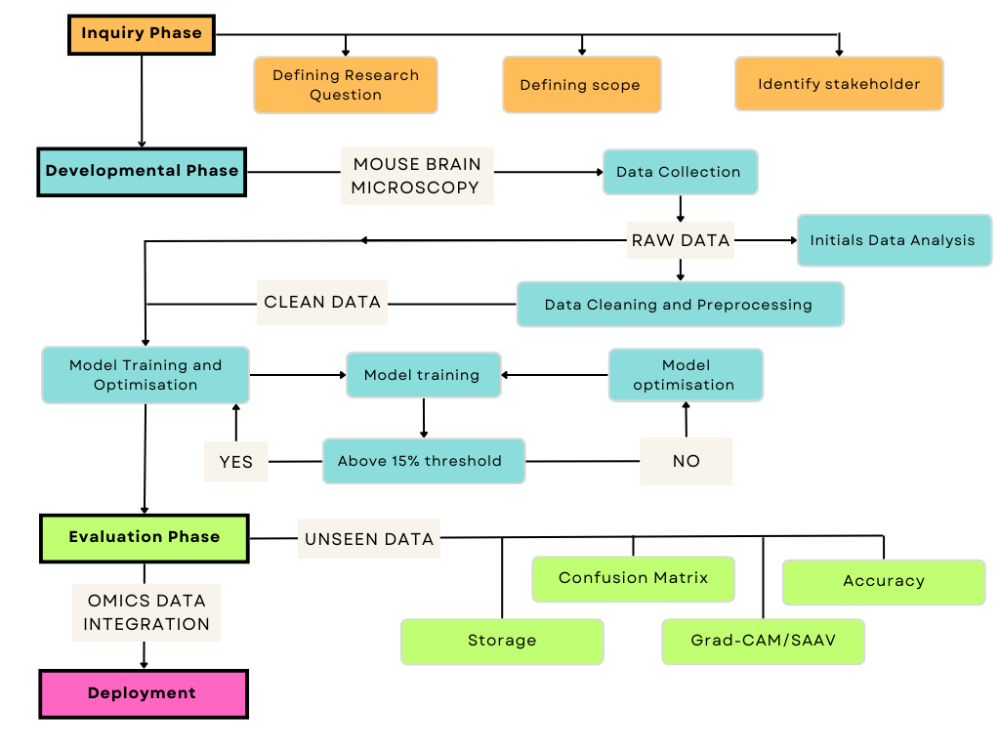

<style>
body {
  font-size: 15px;
}
</style>

```{r setup, include=FALSE}
knitr::opts_chunk$set(echo = TRUE, message = FALSE, warning = FALSE)
```

```{r}
library(knitr)
```

# Executive Summary 

This project explores a deep-learning approach for cell classifications as traditional methods are labour-intensive, time-consuming, and lack feature representation and generalisability. Hence, we aim to find the best deep-learning model by observing the effects of stratification and data cleaning on the performance of pre-trained CNN and Transformer architectures by using the image data from 28 cluster microscopy images of the coronal section of the mouse brain.

From the analysis of accuracy, confusion matrix, Grad-CAM, and model size (storage), the best model was CNN with independent, clean data. It had the best accuracy, interpretability, and least storage requirement. 

The analysis provides insight into the type of input that should be used to maximise performance on pre-trained CNN or Transformer architecture, reducing the costs for creating neural models by eliminating the need to test models with lower performance.

# Report 

## 1 Introduction 

We propose a deep learning approach to overcome the traditional manual analysis's limitations in cell image classification, a crucial task in domains such as biology and medicine. Manual methods are labour-intensive, time-consuming, and require more feature representation and generalisation.

Our work is significant for sectors like pharmaceutical companies engaged in drug discovery and cell behaviour analysis. The proposed method improves efficiency and productivity, offering reliable results that significantly reduce the time and costs tied to medical research.

Deep learning models bring several advantages, including automated feature learning, better generalisation, and a streamlined process. They eliminate the need for manual feature engineering by learning important features from raw data, enhancing cell classification effectiveness.

Our research addresses two key questions. First, we aim to enhance the interpretability of deep learning models, thereby helping researchers understand the underlying patterns the models use. This is essential for insights into the decision-making process. Second, we aim to investigate the impact of training data variations on the performance of various neural architectures. We aim to understand our models' robustness and adaptability for cell classification tasks by systematically tweaking the training data and observing model performance.

```{r, fig.cap="Figure 1: Project Schematic Overview - Four key phases of the project"}

```

## 2 Methodology 

### 2.1 Methodology overview

Figure 1 illustrates the research process, including data collection, initial data analysis, data cleaning and preprocessing, model design, training and optimisation, and evaluation.


### 2.2 Data Collection

We obtained the data from 10X Genomics (2023), consisting of microscopy images of the mouse brain coronal section in the Tagged Image File Format (TIFF or TIF). The gene expression levels of each cell were categorised into 28 distinct clusters, identified by cluster IDs ranging from 1 to 28, and a CSV file with columns for cell IDs and corresponding clusters was created.

Cell boundaries data was used to extract individual cell images (~36000 images) from the full-size image instead of using the provided set of images (~1000 images) to maximise the performance of the final model. Each cell image was saved as a PNG file in the corresponding cluster folder named in the format - "Cell_{X}" - where X represents the unique cell id given to each cell.


### 2.3 Initial Data Analysis

```{r, cache = TRUE, fig.cap = "Figure 2: Initial Data Analysis : Number of images per cluster (left) and Dimensions of each images in data(right)"}
knitr::include_graphics("EDA.png")
```

Figure 2(Left)  illustrates a notable trend of rising images from cluster 28 to cluster 1. This observation highlights a substantial imbalance in the dataset's cluster distribution, which we should consider during the model training process. 

Figure 2(Right) highlights varying dimensions of images in the dataset, emphasising the need for proper resizing to enable efficient feature extraction and representation (See *A2*).


### 2.4 Data Cleaning and Preprocessing

We first resized all images to a resolution of 224 x 224 pixels to ensure compatibility with pre-trained models and improve the training process's computational efficiency. Then we normalised each pixel by dividing the pixel value by the 99th percentile pixel value to minimise any potential variation in pixel intensity.

We masked the pixels outside the cell boundaries to isolate the region of interest and reduce image noise. The generated clean images were saved separately from the original data and were managed using the same file structure. 


### 2.5 Model Development

#### 2.5.1 Model and training data design

Two neural architectures, Convolutional Neural Networks (CNNs) and Transformers, were chosen for comparison in this project. CNNs effectively capture spatial information and extract hierarchical features from images, while Transformers excel in modelling global context and dependencies within images.

The raw and clean data were divided into train-validation and test sets using an 80:20 split ratio stratified sampling. Then the train-validation set was again split into 80:20 ratio, independently or stratified. Stratified and independent sampling was used to explore the impact of different sampling methods. We expect the stratified models to perform better as the data is imbalanced between clusters.

We have developed 8 models to investigate various combinations of architectures, sampling methods, and data types (raw and clean). 

#### 2.5.2 Model Building and Training 
 
We used categorical cross-entropy loss function for the models with a batch size of 128 and 30 epochs. These choices balanced model convergence and computational time, optimised resource usage, and maintained accurate gradient estimation. We monitored plots to detect overfitting and underfitting (see *A3*).

We also employed pre-trained models (Resnet50V2 for CNN and Vision Transformers for Transformers) to leverage existing knowledge, improve efficiency and generalisation. (See *A4 & A5*)

**CNN**

ResNet50V2 has 50 layers and includes convolutional blocks with shortcut connections; this model addresses the challenge of vanishing gradients in deep networks using residual blocks with skip connections. These connections enable the model to effectively learn residual mappings, capturing the input and desired output differences. The pretrained ResNet50V2 classification layer was replaced and the last three layers were unfreezed to fine tune the model.

**Transformer**

The transformer architecture consists of stacked transformer blocks connected through attention connections. This allows the model to selectively focus on different parts of the input sequence during generation.

Vision transformers convert 2D images into patch sequences, processed via a self-attention mechanism for meaningful image representations. The multi-head mechanism of vision transformers allows the model to attend to multiple positions or patches simultaneously. Each position has its attention weights, combined to capture various patterns and relationships within the image. Feed-forward neural networks are also applied to each patch, incorporating non-linear activations to capture complex relationships.


#### 2.5.3 Model Optimisation

All models were optimised until validation accuracy was higher than the 15% threshold, significantly higher than the random guess probability of 1/28. The following optimisation techniques were applied. (See Github link in *A1*)

<ul>
  <li>Data Augmentation</li>
  <ul>
    <li>Applies various transformations to increase the size of the training dataset</li>
      <ul>
        <li>Rotation Range</li>
        <li>Width Shift Range</li>
        <li>Height Shift Range</li>
        <li>Shear Range</li>
        <li>Zoom Range</li>
        <li>Horizontal Flip</li>
        <li>Fill Mode</li>
        </ul>
    <li>Ensure model is robust and generalizable</li>
  </ul>
</ul>


<ul>
  <li>Adam Optimisers with Decaying Learning Rate Schedule</li>
    <ul>
       <li>Fine-tune the model's learning process</li>
       <li>Enhancing its generalisation and performance by adaptively optimising the learning rate during training</li>
    </ul>
</ul>


<ul>
  <li>Batch Normalisation</li>
    <ul>
       <li>Normalises the inputs within each mini-batch during training</li>
       <li>Enables faster training by reducing internal covariate shift</li>
       <li>Improves generalisation by stabilising the learning process</li>
    </ul>
</ul>


<ul>
  <li>Early stopping</li>
    <ul>
      <li>Monitors the validation loss during training and stops the training process if there is no improvement within the specified patience</li>
      <li>Restore the best weights of the model on the validation set</li>
      <li>Prevents overfitting, saves computational resources, and avoids unnecessary training epochs</li>
    </ul>
</ul>


<ul>
  <li>L2 Regularizer</li>
    <ul>
      <li>Applied to the model's weights by adding an additional term to the loss function </li>
      <li>Promotes smaller weights, reduces overfitting, and encourages generalisation by preventing over-reliance on individual features</li>
    </ul>
</ul>

<ul>
  <li>Dropout
    <ul>
      <li>Randomly disabling parts of the model during training forces the network to learn more robust and generalised features</li>
      <li>Reduces overfitting by encouraging the model to focus on salient features</li>
      <li>Improves computational efficiency</li>
    </ul>
  </li>
</ul>


### 2.6 Evaluation

Models' performances were measured using unseen data to assess their generalisability. Accuracy was our primary quantitative evaluation metric as it is simple and intuitive, and side-by-side bar plots to visualise the accuracy. We used confusion matrices to identify misclassifications across different clusters and assess any imbalances or biases in the classification results.

Gradient-weighted Class Activation Mapping (Grad-CAM) for CNN and Spatially Adaptive Activation Value (SAAV) for Transformers allowed us to visualise where the model was focusing on and assess if the models correctly identified relevant patterns qualitatively. Deviations from expected patterns indicate the need for further training or data collection efforts to enhance pattern understanding (Team, n.d.).

Storage requirement was also measured to optimise resource allocation by minimising the storage resources needed for deploying and running the models, thus enhancing cost-effectiveness.

The model selection process prioritises accuracy and confusion matrix outputs. Grad-CAM and SAAV were used to assess the interpretability and validity of the models, and more interpretable models with slightly lower accuracy were considered potential candidates. Lastly, models with smaller sizes are preferred.

This approach allowed us to choose a final model that balanced satisfactory accuracy, interpretability, and cost-effectiveness. These factors were deemed important for our stakeholders.


## 3 Results 


### 3.1 Performance Metrics 

#### 3.1.1 Accuracy

```{r, fig.cap = "Figure 3 : Test accuracy comparison between models"}
## add a table 
library(knitr)
library(kableExtra)
library(ggplot2)
library(cowplot)
library(ggplot2)


# Make sure the "Model_result" folder is in the same directory as below, else change your file path
library(ggplot2)
output1 = read.csv("Biotechnology/Model_result/output_clean_independent_cnn.csv")
output2 = read.csv("Biotechnology/Model_result/output_raw_independent_cnn.csv")
output3 = read.csv("Biotechnology/Model_result/output_clean_stratified_cnn.csv")
output4 = read.csv("Biotechnology/Model_result/output_raw_stratified_cnn.csv")
output5 = read.csv("Biotechnology/Model_result/output_clean_independent_transformers.csv")
output6 = read.csv("Biotechnology/Model_result/output_raw_independent_transformers.csv")
output7 = read.csv("Biotechnology/Model_result/output_clean_stratified_transformers.csv")
output8 = read.csv("Biotechnology/Model_result/output_raw_stratified_transformers.csv")
accuracy1 = round(unique(output1$Test.Accuracy),3)
accuracy2 = round(unique(output2$Test.Accuracy),3)
accuracy3 = round(unique(output3$Test.Accuracy),3)
accuracy4 = round(unique(output4$Test.Accuracy),3)
accuracy5 = round(unique(output5$Test.Accuracy),3)
accuracy6 = round(unique(output6$Test.Accuracy),3)
accuracy7 = round(unique(output7$Test.Accuracy),3)
accuracy8 = round(unique(output8$Test.Accuracy),3)

Test = NA

Test <- data.frame(
  Architecture = c("CNN", "CNN", "CNN", "CNN", "Transformers", "Transformers", "Transformers", "Transformers"),
  Sampling_Method = c("Independent", "Independent", "Stratified", "Stratified", "Independent", "Independent", "Stratified", "Stratified"),
  Data_Types = c("Clean", "Raw", "Clean", "Raw", "Clean", "Raw", "Clean", "Raw"),
  Accuracy = c(accuracy1, accuracy2, accuracy3, accuracy4, accuracy5, accuracy6, accuracy7, accuracy8)
)

Test$Sampling_Method = as.factor(Test$Sampling_Method)
Test$Architecture = as.factor(Test$Architecture)
Test$Data_Types = as.factor(Test$Data_Types)


# for plots 
data = NA
data <- data.frame(
  Model = c("Independent Split - Clean", "Independent Split - Raw", "Stratified Split - Clean","Stratified Split - Raw", "Independent Split - Clean", "Independent Split - Raw" ,"Stratified Split - Clean", "Stratified Split - Raw"),
  Architecture = c("CNN","CNN","CNN","CNN","Tranformers","Tranformers", "Tranformers","Tranformers"),
  Accuracy = c(accuracy1, accuracy2, accuracy3, accuracy4, accuracy5, accuracy6, accuracy7, accuracy8)
)

data$Model = as.factor(data$Model)
data$Architecture = as.factor(data$Architecture)

library(knitr)
library(ggplot2)
library(gridExtra)

p1 = ggplot(data = data) +
  geom_bar(aes(x = Model, y = Accuracy, fill = Architecture), stat = "identity", position = "dodge", width = 0.6) +
  labs(title = "Test Accuracy by Model",
       x = "Training Data",
       y = "Accuracy") +
  theme(axis.text.x = element_text(angle = 30, hjust = 1)) + 
    scale_fill_brewer(palette = "Set3")

library("ggpmisc")
ggp_table <- ggplot() +                             # Create empty plot with table
  theme_void() +
  annotate(geom = "table",
           x = 1,
           y = 1,
           label = list(Test),
          width = unit(0.6, "npc"),  # Adjust the width of the table
           height = unit(0.6, "npc"))

# Arrange the table and plot side by side with increased gap
plot_grid(ggp_table, p1, ncol = 1, rel_heights = c(0.4, 0.6), rel_widths = c(0.6, 0.3), align = "v")


```

CNN and Transformers models demonstrated improved performance when trained on clean data compared to raw data. However, there was a notable difference in the preferred data sampling strategy; while CNN models benefited from independent sampling, Transformers models yielded better results with stratified sampling. On average, CNN models outperformed the Transformers model. 

The best model for accuracy was CNN architecture, independent sampling with clean data. The worst-performing model was Transformer, independent sampling with raw data. 


#### 3.1.2 Confusion Matrix 

```{r , fig.cap = "Figure 4 : Confusion Matrix ( X: Predicted Labels, Y: True Labels)" }

library(cowplot)
library(magick)

# Read the PNG images
image1 <- image_read("Confusion_Matrix/Cmax_CNN_Whole_Clean.png")
image2 <- image_read("Confusion_Matrix/Cmax_CNN_Whole_Raw.png")
image3 <- image_read("Confusion_Matrix/Cmax_CNN_Stratified_Clean.png")
image4 <- image_read("Confusion_Matrix/Cmax_CNN_Stratified_Raw.png")
image5 <- image_read("Confusion_Matrix/Cmax_ViT_Clean_Whole.png")
image6 <- image_read("Confusion_Matrix/Cmax_ViT_Raw_Whole.png")
image7 <- image_read("Confusion_Matrix/Cmax_ViT_Clean_Stratified.png")
image8 <- image_read("Confusion_Matrix/Cmax_ViT_Raw_Stratified.png")

# Set the subcaptions for each image
subcaptions <- c("CNN :Independent Clean", "CNN :Independent Raw", "CNN :Stratified Clean", "CNN :Stratified Raw", "Transformer: Independent Clean", "Transformer: Independent Raw", "Transformer: Stratified Clean", "Tranformer: Stratified Raw")

# Create plots using the images and add subcaptions
plot1 <- ggdraw() + draw_image(image1) +
  draw_label(subcaptions[1], size = 8, fontface = "bold", x = 0.5, y = 0.02, hjust = 0.5)
plot2 <- ggdraw() + draw_image(image2) +
  draw_label(subcaptions[2], size = 8, fontface = "bold", x = 0.5, y = 0.02, hjust = 0.5)
plot3 <- ggdraw() + draw_image(image3) +
  draw_label(subcaptions[3], size = 8, fontface = "bold", x = 0.5, y = 0.02, hjust = 0.5)
plot4 <- ggdraw() + draw_image(image4) +
  draw_label(subcaptions[4], size = 8, fontface = "bold", x = 0.5, y = 0.02, hjust = 0.5)
plot5 <- ggdraw() + draw_image(image5) +
  draw_label(subcaptions[5], size = 8, fontface = "bold", x = 0.5, y = 0.02, hjust = 0.5)
plot6 <- ggdraw() + draw_image(image6) +
  draw_label(subcaptions[6], size = 8, fontface = "bold", x = 0.5, y = 0.02, hjust = 0.5)
plot7 <- ggdraw() + draw_image(image7) +
  draw_label(subcaptions[7], size = 8, fontface = "bold", x = 0.5, y = 0.02, hjust = 0.5)
plot8 <- ggdraw() + draw_image(image8) +
  draw_label(subcaptions[8], size = 8, fontface = "bold", x = 0.5, y = 0.02, hjust = 0.5)

# Arrange the plots in a grid
grid <- plot_grid(plot1, plot2, plot3, plot4, plot5, plot6, plot7, plot8,
                  nrow = 2, ncol = 4, align = "hv")

# Display the grid of plots
print(grid)
```

The confusion matrix revealed consistent misclassification patterns for clusters with larger number counts, indicating a potential bias in the clustering models. However, cluster 5 does not exhibit observable misclassification despite having some of the most number counts. 

Across all models, particularly transformers, clusters 2 and 3, with the top few numbers of images, exhibited vertical patterns, where multiple clusters tend to be misclassified as either of these clusters. In addition, clusters with some of the least image numbers, including clusters from 20 to 28, have little to no prediction in their clusters. 

The CNN model with stratified sampling and clean data misclassified clusters 2 and 4 while demonstrating relatively satisfactory classification results for clusters 3 and 5(diagonal pattern). However, when using raw data, clusters 1 and 3 exhibited misclassification trends, whereas clusters 2 and 7 demonstrated accurate predictions. 

The transformers exhibited satisfactory predictions for cluster 7. In addition, the independently sampled transformer tends to misclassify cells into clusters 1, 4, and 13, whereas the stratified sampling approach mitigated this issue. The impact of clean data is evident in improving predictions for cluster 7 by reducing misclassifications of cells from cluster 7 into cluster 13.

The CNN with independent sampling - clean data exhibited distinct patterns with apparent diagonal trends compared to other models.


### 3.2 Interpretability (Grad-CAM/SAAV)

Grad-CAM (See *A6*) reveals that the top-performing CNN model exhibited strong patterns around cell boundaries, indicating that this model has learned to recognise these features as important for cell classification. Conversely, the other 3 CNNs do not exhibit any discernible patterns. In contrast, none of the Transformers models exhibited consistent patterns in recognising cells (See *A7*). 


### 3.3 Storage 

Transformers required approximately ten times more storage than CNNs, as illustrated in *A8*. 


### 3.4 Deployment 

We developed a Shiny application to allow easy interaction and exploration of the model's capabilities. To include the cell types in our visualisation, we first extracted gene expression values for each cluster from external omics data (2023). The top 5 genes associated with each cluster were identified based on their log2-fold change of gene expression values. Considering multiple genes instead of relying on one gene increases robustness. Each selected gene corresponds to specific cell types, enabling us to assign five probable cell types and determine the most probable cell types for individual cells via majority voting. 

```{r, fig.cap="Figure 5 : Deployment Process and Shiny Apps Interactive Features"}
library(cowplot)
library(magick)

# Read the PNG images
image1 <- image_read("Figure5a.png")
image2 <- image_read("Figure_5.png")

# Create plots using the images and add subcaptions
plot1 <- ggdraw() + draw_image(image1) 
plot2 <- ggdraw() + draw_image(image2)

# Arrange the plots in a grid
grid <- plot_grid(plot1, plot2,
                  nrow = 2, ncol = 1, align = "hv")

# Display the grid of plots
print(grid)
```

In the visualisation, users can choose from a dropdown list of the eight models. The application offers the flexibility to select specific clusters of interest. The informative plots are presented, accompanied by model-specific accuracy values below each plot. If a specific cluster is selected, the accuracy is tailored to that cluster.

We allow users to adjust the size of the data points, enabling manipulation with data representation according to their preferences.

Furthermore, our Shiny application includes two options for cell exploration. Users can either hover over the plots to identify cells in a specific region of interest or directly input the cell IDs they wish to examine. The tooltip provides essential information such as "Cell ID," "Predicted Cluster," "Probabilities," "Top 5 Genes," and "Cell Type" (See *A1* for launching Shiny Apps).

## 4 Discussion

### 4.1 Result Interpretation

#### 4.1.1 Performance metrics

* Accuracy

The performance difference between clean and raw data highlighted the significance of data pre-processing and emphasised the need for appropriate data cleaning techniques to improve model robustness and performance.

The performance variations observed between different sampling methods underscored the sensitivity of these models to data distribution. CNNs' better performance with independent sampling requires further investigation. Stratified sampling, which maintained the data distribution in training data, should provide more accurate results as it is more valid when there was cluster imbalance. Meanwhile, Transformers models achieved better results with stratified sampling, as expected. This highlighted the importance of selecting the appropriate sampling method based on the specific characteristics of the neural architecture and the underlying data distribution.

* Confusion Matrix

The confusion matrix analysis revealed the challenges associated with accurately classifying clusters, with data imbalance identified as a contributing factor. However, the misclassification of cluster 5 suggested that factors beyond data imbalance, such as less prominent or distinct gene expression patterns, also impacted model performance. This indicated the model's potential difficulty in predicting clusters when the gene expression responsible for their defining characteristics is not prominent or distinct.

The CNN model with independent sampling and clean data demonstrated superior classification accuracy, as evidenced by the apparent diagonal pattern in the confusion matrix. This suggests the model's ability to effectively capture subtle changes in gene expression patterns, leading to improved performance. These findings highlighted the importance of employing appropriate data cleaning techniques and sampling methods to enhance model accuracy for cluster classification.

Additionally, the presence of less prominent or distinct gene expression patterns may have contributed to the underprediction of specific clusters by the model. Overall, these observations emphasised the significance of understanding the underlying factors influencing gene expression dynamics and their impact on accurate cluster classification.

#### 4.1.2 Interpretability 

The CNN Independent Sampling - Clean Data model effectively learned and explained important features, providing insights into its decision-making process. In contrast, the other CNNs lacked clear patterns in Grad-CAM, suggesting a limited ability to recognise crucial features, exhibiting lower interpretability. Transformers faced challenges in interpretability due to their reliance on self-attention mechanisms, which lacked explicit spatial information. These results aligned with our objective of improving interpretability in deep learning models for cell classification.

#### 4.1.3 Storage requirement 

Transformers require more storage due to their complex architecture, self-attention mechanisms, and larger parameter size. This trade-off between model complexity and storage should be considered for cost-effectiveness. However, our evaluation demonstrated that CNNs offer superior performance with lower storage requirements, providing a cost-effective advantage over Transformers while maintaining competitive performance.


### 4.2 Limitations and Future Directions

Although the current research suggests that the significant class imbalance and the shared gene expression amongst clusters cause significant misclassification, further research is needed to quantify and fully understand the full impact.

Furthermore, the current model’s accuracy (<20%) makes it not viable for commercial use—however, further research into a regression-based approach, where gene expression values are directly predicted, could reduce the impact of misclassification and the issue of shared gene expression amongst clusters.

Data management and accessibility can also be improved by incorporating a robust database system for storing data and models. We are streamlining our workflow and facilitating efficient information retrieval for further analysis.

We can improve workflow by consolidating and automating the process between data cleaning and model training. Currently, data needed for model training in Python must be processed in R. Simplifying the process will make it accessible to researchers with diverse backgrounds to utilise our pipeline.

Finally, the study can be applied to different fields of biology and could help build models to classify other mammal brain cells. The findings from this research can be used as a starting point for other cell classification tasks, aiding in advancing microbiology and understanding cellular diversity to facilitate novel discoveries.

### 4.3 Conclusion

Our study contributes to deep learning for cell classification by enhancing interpretability and evaluating the impact of training data variations on model performance. The CNN model with independent sampling and clean data emerges as the preferred choice for future application, offering improved accuracy, interpretability, and cost-effectiveness. 

The insights from this project provide valuable guidance for researchers working on cell classification tasks and underscore the importance of data quality and sampling strategies. By advancing our understanding of interpretability and training data effects, our research paves the way for future developments in deep learning models for cell classification in biology.

The scalability of our pipeline is limited by the integration of model outputs with CSV files and the transition from Jupyter Notebook to RStudio for deployment, especially when working with large datasets. Due to computational constraints, we could not perform cross-validation on the results, which may affect the reliability of our findings.


## Contribution
The contributions of the team members to the project are as follows: Jia Hao was responsible for data collection and preprocessing. Louis, Jun Han, Ting Yu, Michael, and Jia Hao contributed to model building, training, and optimization, which involved writing codes. Additionally, Jia Hao and Hana were involved in deploying the final products, where they wrote R codes in RStudio. All team members actively participated in making observations and wrote and edited the reports.


## References 

* (2023). 10xgenomics.com. https://xenium.10xgenomics.com/image/s3%2F10x.files%2Fxenium%2Fpreview%2Fmbrain%2Fanalysis_summary.html 
* Grunau, S., Block, D., & Meier, U. (2018). Multi-label wireless interference identification with convolutional neural networks. https://arxiv.org/abs/1804.04395
* Kim, J., Lee, S., Kim, Y.-H., & Kim, S.-C. (2020). Classification of interference signal for automotive radar systems with convolutional neural network. https://www.researchgate.net/publication/347021656_Classification_of_Interference_Signal_for_Automotive_Radar_Systems_With_Convolutional_Neural_Network 
* Team, K. (n.d.). Keras documentation: Grad-CAM class activation visualization. Keras.io. https://keras.io/examples/vision/grad_cam/
* Oyedare, T. (2023). Keep It Simple: CNN Model Complexity Studies for Interference Classification Tasks. Ar5iv.org. https://arxiv.org/abs/2303.03326 

## Appendix 

### A1 
- Github link containing codes and files required for reproducing projects [Image4](https://github.com/JunAtHome/DATA3888_image_4)


### A2 
- EDA 

- The resulting image generated is used in main report 

- cell_images, generated step by steps as per instructions in github README is needed to run this file
```
library(dplyr)
library(ggplot2)
library(png)
library(patchwork)

## change according to file path 
folder_path <- "Biotechnology/data_processed/cell_images"
clusters <- paste0("cluster_", 1:28)
df <- data.frame(cluster = character(), num_images = integer(), stringsAsFactors = FALSE)
for (cluster in clusters) {
  cluster_path <- file.path(folder_path, cluster)
  num_images <- length(list.files(cluster_path, pattern = "^cell_.*\\.png$"))
  df <- df %>% add_row(cluster = cluster, num_images = num_images)}
df <- df %>% arrange(num_images)
p1 = ggplot(df, aes(x = reorder(cluster, num_images), y = num_images)) +
  geom_bar(stat = "identity", fill = "lightblue") +
  labs(x = "Cluster", y = "Number of Images") +
  theme(axis.text.x = element_text(angle = 90, vjust = 0.5, hjust=1)) +
  ggtitle("Number of Images per Cluster")


library(png)
library(ggplot2)
image_data <- data.frame(Width = numeric(), Height = numeric())
for (cluster_num in 1:28) {
  cluster_dir <- paste0("Biotechnology/data_processed/cell_images/cluster_", cluster_num)
  for (file_name in list.files(cluster_dir, pattern = "^cell_\\d+\\.png$", full.names = TRUE)) {
    img <- readPNG(file_name)
    width <- dim(img)[2]
    height <- dim(img)[1]
    image_data <- rbind(image_data, data.frame(Width = width, Height = height))
  }
}
p2 = ggplot(image_data, aes(x = Width, y = Height)) +
  geom_point(size = 0.5) +
  xlab("Width") +
  ylab("Height") +
  ggtitle("Image Dimensions EDA")

 combined <- p1+ p2 +
   plot_layout(ncol = 2)
 combined
 
suppressMessages(ggsave("EDA.PNG", combined,width = 10, height = 6))

```

### A3
```{r, fig.cap = "Sample Training Process"}
## access the data from history file 

history = read.csv("Biotechnology/History/history_clean_whole_cnn_2.csv")

library(ggplot2)
library(patchwork)
# Specify custom colors and labels
custom_colors <- c("blue", "red")
custom_labels <- c("Train", "Validation")

# Plot the lines with custom colors and labels
a1 = ggplot(data = history) +
  geom_line(aes(x = epoch, y = train_accuracy, color = "Train")) +
  geom_line(aes(x = epoch, y = validation_accuracy, color = "Validation")) +
  scale_color_manual(values = custom_colors, labels = custom_labels) +
  labs(x = "Epoch", y = "Accuracy", title = "Accuracy : CNN Independent - Raw ", colour = "") +
  theme_bw() + 
    theme(axis.text = element_text(size = 8),   # Reduce axis text size
        plot.title = element_text(size = 10))  # Reduce plot title size

# Plot the lines with custom colors and labels
a2 = ggplot(data = history) +
  geom_line(aes(x = epoch, y = loss, color = "Train")) +
  geom_line(aes(x = epoch, y = validation_loss, color = "Validation")) +
  scale_color_manual(values = custom_colors, labels = custom_labels) +
  labs(x = "Epoch", y = "Loss", title = "Loss : CNN Independent - Clean", colour = "") +
  theme_bw() + 
    theme(axis.text = element_text(size = 8),   # Reduce axis text size
        plot.title = element_text(size = 10))  # Reduce plot title size

combineda1 <- a1+ a2 + 
  plot_layout(ncol = 2)
combineda1

```


### A4 
- CNN Pre-trained Model code 
```
import os
import pandas as pd
import numpy as np
from tensorflow.keras import layers
from tensorflow.keras.models import Sequential
import tensorflow as tf
from tensorflow.keras.regularizers import l2
from tensorflow.keras import layers, models
from tensorflow.keras.applications import ResNet50V2
from tensorflow.keras.preprocessing.image import ImageDataGenerator


cluster_numbers = list(range(1, 29))
image_size = 224
num_classes = len(cluster_numbers)
batch_size = 128


# Define the custom object ClassToken
class ClassToken(layers.Layer):
    def __init__(self, **kwargs):
        super(ClassToken, self).__init__(**kwargs)


    def build(self, input_shape):
        self.class_token = self.add_weight(
            shape=(1, 1, input_shape[3]),
            initializer=tf.keras.initializers.TruncatedNormal(stddev=0.02),
            trainable=True,
            name="class_token",
        )
        super(ClassToken, self).build(input_shape)


    def call(self, x):
        batch_size = tf.shape(x)[0]
        # Add a class token
        class_token = tf.broadcast_to(self.class_token, [batch_size, 1, 1, tf.shape(self.class_token)[2]])
        x = tf.concat([class_token, x], axis=1)
        return x


train_datagen = ImageDataGenerator(
    rotation_range=15,
    width_shift_range=0.2,
    height_shift_range=0.2,
    shear_range=0.2,
    zoom_range=0.2,
    horizontal_flip=True,
    fill_mode='nearest'
)


train_generator = train_datagen.flow(
    train_images,
    train_labels,
    batch_size=128,
    shuffle=True
)


# Load the pre-trained ResNet50V2 model without the top layer (global average pooling and fully connected layers)
base_model = ResNet50V2(include_top=False, weights='imagenet', input_shape=(224, 224, 3))


# Freeze the top layers
for layer in base_model.layers:
    layer.trainable = False


# Unfreeze the last few convolutional layers and the batch normalization layers
for layer in base_model.layers[-10:]:
    if not isinstance(layer, layers.BatchNormalization):
        layer.trainable = True


# Add new top layers for the new dataset
x = base_model.output
x = layers.GlobalAveragePooling2D()(x)
x = layers.Dense(128, activation='relu', kernel_regularizer=l2(0.01))(x)
x = layers.BatchNormalization()(x)
x = layers.Dropout(0.4)(x)
predictions = layers.Dense(num_classes, activation='softmax')(x)


# Create the new model by combining the base model and the top layers
model = models.Model(inputs=base_model.input, outputs=predictions)


lr_schedule = tf.keras.optimizers.schedules.ExponentialDecay(
    initial_learning_rate=1e-4,
    decay_steps=10000,
    decay_rate=0.9
)
optimizer = tf.keras.optimizers.Adam(learning_rate=lr_schedule)


early_stopping = tf.keras.callbacks.EarlyStopping(
    monitor='val_loss',
    patience=5,
    restore_best_weights=True
)


# Compile the model
model.compile(optimizer= optimizer, loss='categorical_crossentropy', metrics=['accuracy'])


models_dir = 'saved_4_models'
if not os.path.exists(models_dir):
    os.makedirs(models_dir)


model_checkpoint = tf.keras.callbacks.ModelCheckpoint(
    os.path.join(models_dir, 'CNN_whole_clean_optimised_last.h5'),
    monitor='val_loss',
    save_best_only=True,
    save_weights_only=False
)
epochs = 30

# Train the model with model checkpointing
history = model.fit(
    train_generator,
    steps_per_epoch=len(train_images) // batch_size,
    epochs=epochs,
    validation_data=(validation_images, validation_labels),
    callbacks=[early_stopping, model_checkpoint]
)

model = tf.keras.models.load_model(os.path.join(models_dir, 'CNN_whole_clean_optimised_last.h5'))
```


### A5 
-Transformers Pre-Trained Model code 

```
import numpy as np
import pandas as pd
import os
import cv2
import re
import sklearn
from sklearn.model_selection import train_test_split
import tensorflow as tf
from tensorflow.keras.preprocessing.image import ImageDataGenerator
from vit_keras import vit


def create_vit_model(image_size, num_classes):
    vit_model = vit.vit_b32(
        image_size=image_size,
        activation='softmax',
        pretrained=False,
        include_top=True,
        pretrained_top=False,
        classes=num_classes
    )


    model = tf.keras.Model(inputs=vit_model.inputs, outputs=vit_model.outputs)
    return model


image_size = 224
num_classes = len(cluster_numbers)


model = create_vit_model(image_size, num_classes)


lr_schedule = tf.keras.optimizers.schedules.ExponentialDecay(
    initial_learning_rate=1e-4,
    decay_steps=10000,
    decay_rate=0.9
)
optimizer = tf.keras.optimizers.Adam(learning_rate=lr_schedule)


model.compile(
    optimizer=optimizer,
    loss=tf.keras.losses.CategoricalCrossentropy(from_logits=True),
    metrics=['accuracy']
)


epochs = 30
batch_size = 128


data_augmentation = ImageDataGenerator(
    rotation_range=15,
    width_shift_range=0.1,
    height_shift_range=0.1,
    shear_range=0.1,
    zoom_range=0.1,
    horizontal_flip=True,
    fill_mode='nearest'
)


train_generator = data_augmentation.flow(train_images, train_labels, batch_size=batch_size)


early_stopping = tf.keras.callbacks.EarlyStopping(
    monitor='val_loss',
    patience=5,
    restore_best_weights=True
)


models_dir = 'saved_4_models'
if not os.path.exists(models_dir):
    os.makedirs(models_dir)


model_checkpoint = tf.keras.callbacks.ModelCheckpoint(
    os.path.join(models_dir, 'vit_clean_whole3.h5'),
    monitor='val_loss',
    save_best_only=True,
    save_weights_only=False
)


history = model.fit(
    train_generator,
    steps_per_epoch=len(train_images) // batch_size,
    epochs=epochs,
    validation_data=(validation_images, validation_labels),
    callbacks=[early_stopping, model_checkpoint]
)


model = tf.keras.models.load_model(os.path.join(models_dir, 'vit_clean_whole3.h5'))
```

### A6 
- Grad Cam
```{r, fig.cap = "Interpretability for CNN Models"}
library(cowplot)
library(magick)

# Read the PNG image
image1 <- image_read("Interpretability/Grad_Cam_Independent_Clean.png")
image2 <- image_read("Interpretability/Grad_Cam_Independent_Raw.png")
image3 <- image_read("Interpretability/Grad_Cam_Stratified_Clean.png")
image4 <- image_read("Interpretability/Grad_Cam_Stratified_Raw.png")


 subcaptions <- c("Independent Clean", "Independent Raw", "Stratified Clean", "Stratified Raw")

# Create plots using the images and add subcaptions
plot1 <- ggdraw() + draw_image(image1) +
  draw_label(subcaptions[1], size = 12, fontface = "bold", x = 0.5, y = 0.02, hjust = 0.5)
plot2 <- ggdraw() + draw_image(image2) +
  draw_label(subcaptions[2], size = 12, fontface = "bold", x = 0.5, y = 0.02, hjust = 0.5)
plot3 <- ggdraw() + draw_image(image3) +
  draw_label(subcaptions[3], size = 12, fontface = "bold", x = 0.5, y = 0.02, hjust = 0.5)
plot4 <- ggdraw() + draw_image(image4) +
  draw_label(subcaptions[4], size = 12, fontface = "bold", x = 0.5, y = 0.02, hjust = 0.5)

# Arrange the plots in a grid
grid <- plot_grid(plot1, plot2, plot3, plot4,
                  nrow = 1, ncol = 4, align = "hv")

# Display the grid of plots
print(grid)

```


### A7
- SAAV 

```{r, fig.cap = "Interpretability for transformers models"}
library(cowplot)
library(magick)
# 
 # Read the PNG image
 image1a <- image_read("Interpretability/SAAV_Whole_Clean2.png")
 image2a <- image_read("Interpretability/SAAV_Whole_Raw2.png")
 image3a <- image_read("Interpretability/SAAV_Stratified_Clean2.png")
 image4a <- image_read("Interpretability/SAAV_Stratified_Raw2.png")
# Set the subcaptions for each image

 subcaptions <- c("Independent Clean", "Independent Raw", "Stratified Clean", "Stratified Raw")

# Create plots using the images and add subcaptions
plot1 <- ggdraw() + draw_image(image1a) +
  draw_label(subcaptions[1], size = 12, fontface = "bold", x = 0.5, y = 0.02, hjust = 0.5)
plot2 <- ggdraw() + draw_image(image2a) +
  draw_label(subcaptions[2], size = 12, fontface = "bold", x = 0.5, y = 0.02, hjust = 0.5)
plot3 <- ggdraw() + draw_image(image3a) +
  draw_label(subcaptions[3], size = 12, fontface = "bold", x = 0.5, y = 0.02, hjust = 0.5)
plot4 <- ggdraw() + draw_image(image4a) +
  draw_label(subcaptions[4], size = 12, fontface = "bold", x = 0.5, y = 0.02, hjust = 0.5)

# Arrange the plots in a grid
grid <- plot_grid(plot1, plot2, plot3, plot4,
                  nrow = 1, ncol = 4, align = "hv")

# Display the grid of plots
print(grid)

```

### A8 
- Storage 
```{r}
library(htmlTable)
# Create a data frame with the given data
data <- data.frame(
  Architecture = c("CNN", "CNN", "CNN", "CNN", "Transformers", "Transformers", "Transformers", "Transformers"),
  Sampling_Method = c("Independent", "Independent", "Stratified", "Stratified", "Independent", "Independent", "Stratified", "Stratified"),
  Data_Types = c("Clean", "Raw", "Clean", "Raw", "Clean", "Raw", "Clean", "Raw"),
  Storage_MB = c("119.5","119.5","119.5","119.5", "1101.8","1101.8","1101.8","1101.8"))

colnames(data)= c("Neural Architecture", "Sampling Method", "Data Types", "Storage(MB)")

# Convert the dataframe to a table using kable
knitr::kable(data)

```

## Package needed
```{r}
sessionInfo()
```

